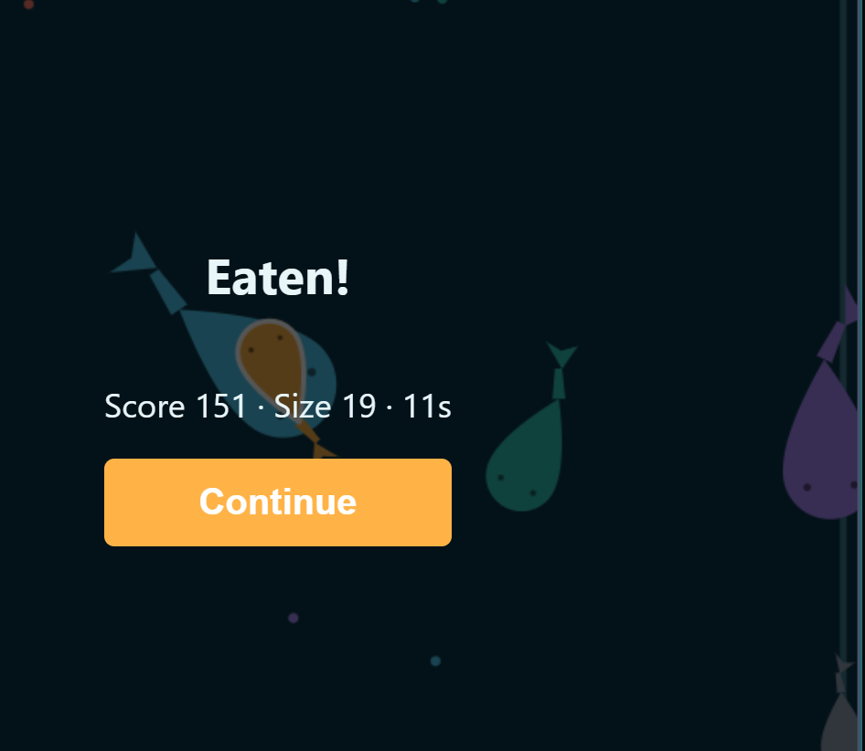
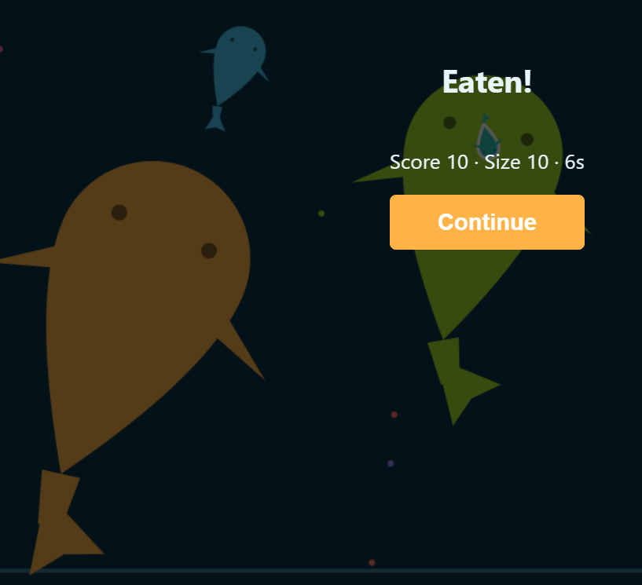
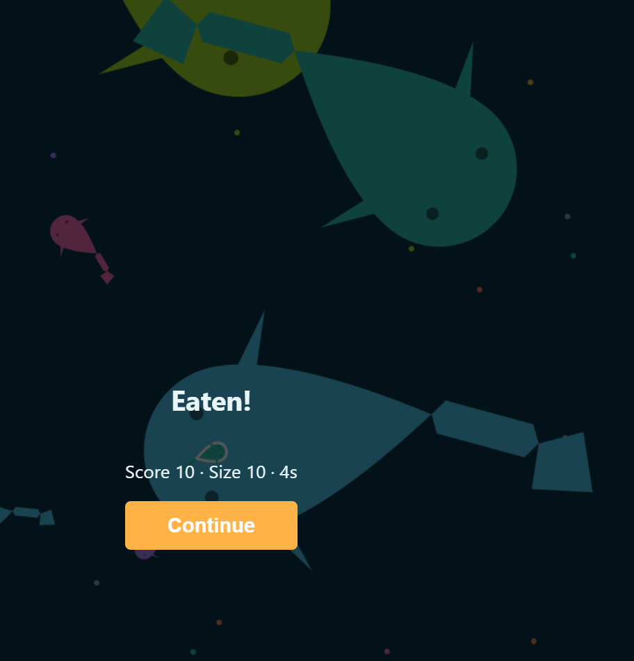
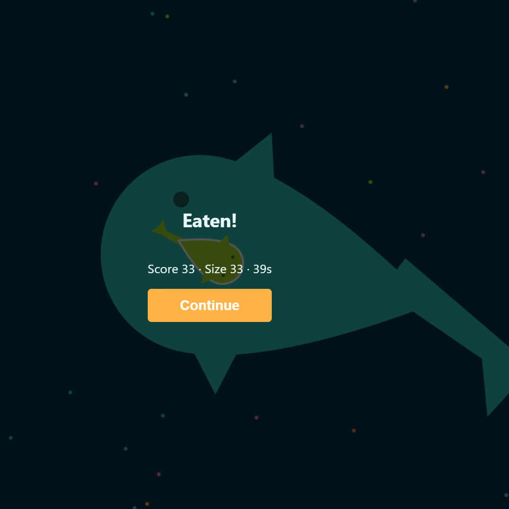
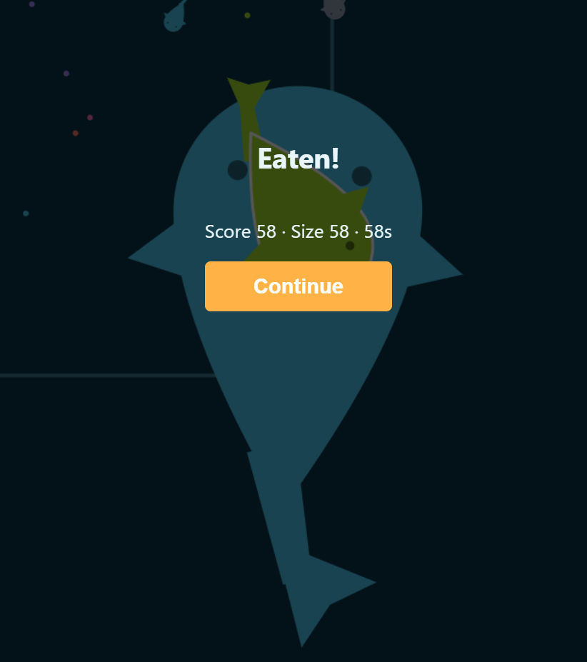

# Process overview

I started with a plan rather than code: [`a935ac5`](https://github.com/comp4020-agentic-coding-studio/comp4020-final-quackyduck826/commit/a935ac5) sketched the concept (an .io-style fish game, bots standing in for other players) and what "good" meant for the week before anything existed.

From there the loop was plan → execute → check in. I built the server and client ([`8eb7c42`](https://github.com/comp4020-agentic-coding-studio/comp4020-final-quackyduck826/commit/8eb7c42)...[`acc5a37`](https://github.com/comp4020-agentic-coding-studio/comp4020-final-quackyduck826/commit/acc5a37)), deployed to Fly, played it, and came back with a list of what felt off.

**Stack decision**: plain Node running TypeScript natively, serving vanilla JS from `public/`, canvas 2D for rendering — no framework or bundler, so the whole stack fits in one head. The leaderboard persists as a JSON file on the Fly volume at `/data`, not a database: writes are small, infrequent, single-process, and a DB service would be overhead with no payoff yet. I'd reach for SQLite on the same volume first if concurrent writes or richer queries ever mattered, and record that switch here. I reverified the leaderboard survived every redeploy, since that's the one thing a bad deploy could quietly wipe.

Most of the work after was small and visual, against a live dev server so I could eyeball each change. The fish rendering went through several passes chasing a shape that reads as a fish from above — articulated tail first ([`7717fee`](https://github.com/comp4020-agentic-coding-studio/comp4020-final-quackyduck826/commit/7717fee)), merging the tail segments into one piece ([`df3ffa6`](https://github.com/comp4020-agentic-coding-studio/comp4020-final-quackyduck826/commit/df3ffa6)), then widening the fins ([`1a4c6db`](https://github.com/comp4020-agentic-coding-studio/comp4020-final-quackyduck826/commit/1a4c6db)). Screenshots of those stages are below.

I treated bugs and polish separately. One bug: bots jittered left-right choosing between two threats to flee, traced to the AI recomputing the nearest target every frame with no memory — fixed with sticky target selection and a turn-rate cap ([`7524d8f`](https://github.com/comp4020-agentic-coding-studio/comp4020-final-quackyduck826/commit/7524d8f)...[`8591feb`](https://github.com/comp4020-agentic-coding-studio/comp4020-final-quackyduck826/commit/8591feb)). Polish came from brainstorming what would make the game feel finished: a live leaderboard, fish-pun bot names, a dash cooldown bar, the pond.io rebrand ([`a6402af`](https://github.com/comp4020-agentic-coding-studio/comp4020-final-quackyduck826/commit/a6402af)...[`0a2c848`](https://github.com/comp4020-agentic-coding-studio/comp4020-final-quackyduck826/commit/0a2c848)).

Fish rendering through those stages — 3 was reverted back to 2's approach before continuing on to 4 and 5:

